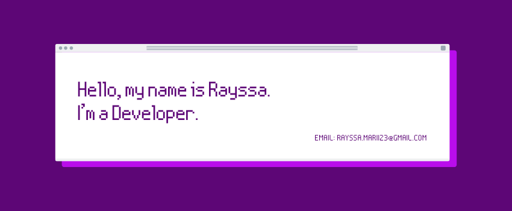

```JavaScript

const whoIsMe = {
 name: "Rayssa Santana",
 age: 27,
 state: "Frontend Developer",
 country: "Brazil",
 softSkills: [
   'communication',
   'teamwork',
   'Problem solving and creativity',
   'organization' 
  ],
  openToWork: true
}	

function contactMe() {
  return {
    email: 'rayssa.marii23@gmail.com',
    linkedin: 'https://www.linkedin.com/in/rayssa-mariana-s/'
  }
}

```


<section align="center" width="335px">
 
    
 
     
 
    
 
   
 
   
 
  
 
 
</section> 


